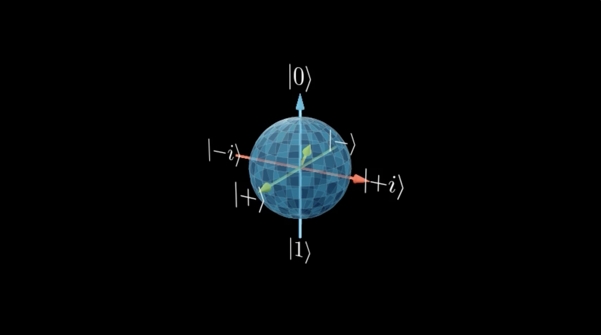
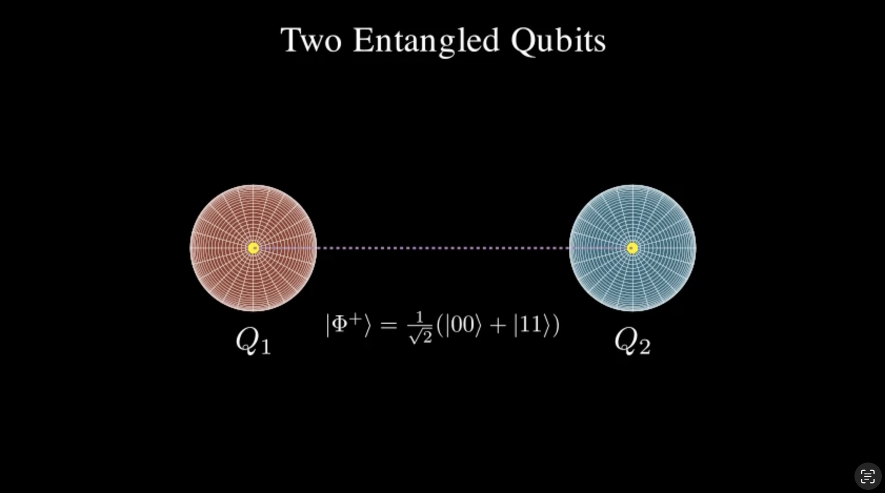

# Quantum-Representations

## Overview
This Manim script provides an interactive and visual representation of a 3D undirected graph. The vertices are represented by `Sphere` mobjects, while the edges are visualized using `Line` mobjects. The script enables users to dynamically generate and manipulate cyclical graphs in a 3D space.

## Features
- **Customizable Graph Structures**: Users can define multiple graphs, specifying the number of nodes per graph.
- **Interactive Visualization**: The script includes methods to inspect and manipulate nodes, such as zooming into specific nodes and visualizing their internal structures.
- **Portable and Flexible**: The script is modular and allows users to easily adjust graph parameters and animation sequences.
- **Smooth Camera Transitions**: Ensures fluid navigation between different graph perspectives.

## Usage
To use this script:
1. Specify your graph parameters, including the number of graphs and the number of nodes per graph.
2. Modify the `construct()` method to customize the visualization sequence.
3. Run the script using Manim to generate an animated video of your graph system.

This script serves as a foundation for more advanced graph visualizations and can be adapted for various applications, including network analysis and quantum computing simulations.

Also find manim_circuit.py and matrix_transformations.py for further operations in quantum theory visualized through manim. Updated code will be uploaded by 2/12.

This repository is actively being modified. Final visualization will be a comprehensive introduction to quantum theory.
